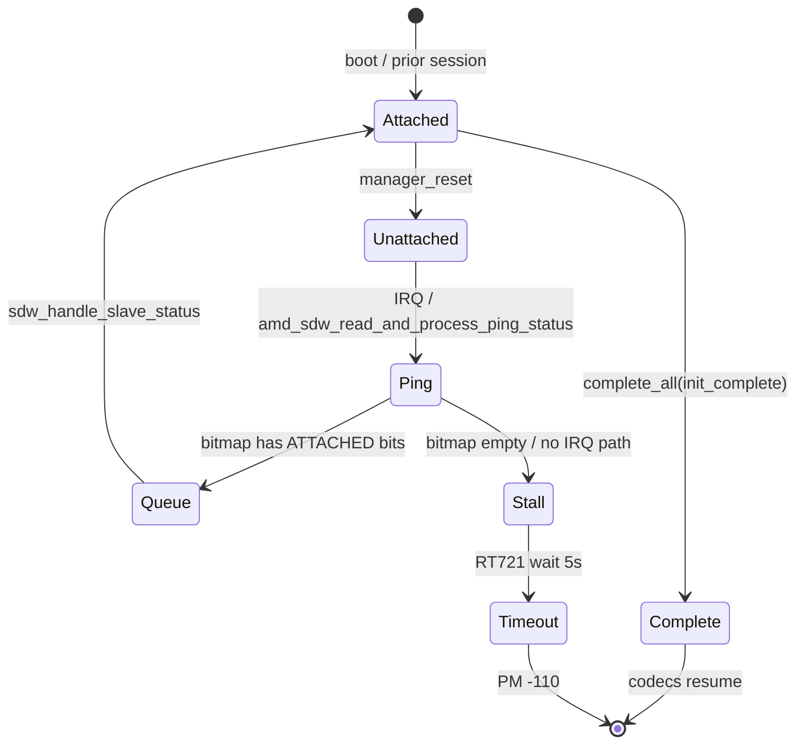

# SoundWire resume state machine (ACP70 / Phase 6)

English (canonical). **Conservative claims** — what evidence supports today vs what the AMD trace must prove next.

See also: [LINK-REENUMERATION-FAILURE.md](LINK-REENUMERATION-FAILURE.md), [SDW-INITIALIZATION-COMPLETE-MAP.md](SDW-INITIALIZATION-COMPLETE-MAP.md)

---

## What we can state today (run 0004 + bus PHASE6)

| # | Statement | Evidence |
|---|-----------|----------|
| 1 | Not RT721-specific | dev=1,2,3 all `ATTACHED→UNATTACHED` on `manager_reset`; none return to `ATTACHED` in window |
| 2 | Not TAS2783 root cause | FW path never starts if bus never completes `initialization_complete` |
| 3 | Critical event is `manager_reset` | All known FAIL windows start here |
| 4 | `-110` is consequence | `wait_for_completion_timeout(5000)` with no `complete_all()` |

**Not yet proven:** *where* the post-reset chain breaks (IRQ, PING, bitmap, work, or bus handle). Wording like “re-enumeration broken” is **compatible** with observations but should wait for AMD `ping_status` / `handle_status` captures.

---

## State machine (target model)



ASCII equivalent:

```text
ATTACHED
    │  manager_reset (system_resume, POWER_OFF)
    ▼
UNATTACHED  ←── all slaves (dev 1,2,3 on PX13)
    │
    ▼
PING  (amd_sdw_read_and_process_ping_status)
    │
    ├─ bitmap/devmask ≠ 0 ──► QUEUE_WORK ──► handle_status ──► ATTACHED ──► completion
    │
    └─ no PING / bitmap==0 ──► (stall) ──► wait_init_timeout @ ~5000ms
```

---

## Investigation levels

### Level 1 — PING path (log evidence, not proof of absence)

AMD patch [`0003-phase6-amd-sdw-trace.patch`](proposed/0003-phase6-amd-sdw-trace.patch) tags each **system** resume with `resume=N` (`resume=0` = runtime PM).

**Wording:** if no `ping_status` line appears, write *“no log evidence of PING processing”* — not *“PING did not run”* until IRQ/`read_and_process_ping_status` entry trace confirms.

| Outcome | Trace sketch |
|---------|----------------|
| **PASS** | `resume=N manager_reset` → `ping_status resume=N` → `queue_work` → bus `ATTACHED` → `completion` |
| **FAIL-A?** | `resume=N manager_reset` → no `ping_status`/`queue_work`/`handle_status` with same `resume=N` |
| **FAIL-B?** | `ping_status` → empty `devmask` / all UNATTACHED in `handle_status` |
| **FAIL-C?** | `devmask≠0` → no bus `new=ATTACHED` |

**2026-07-10 capture (AMD trace present):** one `amd manager_reset link=1` + three **bus** `slave_detach dev=1,2,3` traces (one reset, per-slave state_change — not four resets). No `ping_status resume=N` log during RT721 `wait_init_timeout` at **kernel t=+5210ms**. Interpretation: **no log evidence** of PING processing in that transaction; next step: `pci-ps` IRQ trace or `ping_status` function entry log.

AMD patch [`0003-phase6-amd-sdw-trace.patch`](proposed/0003-phase6-amd-sdw-trace.patch):

| Outcome | Trace sketch |
|---------|----------------|
| **PASS** | `manager_reset t=+0` → `ping_status` → `queue_work devmask=0x…` → bus `ATTACHED` → `completion` |
| **FAIL-A** | `manager_reset` → *(no `ping_status`, no `queue_work`)* |
| **FAIL-B** | `manager_reset` → `ping_status resp=0x…` → `devmask=0` / all `st*=UNATTACHED` |
| **FAIL-C** | `manager_reset` → `devmask≠0` → bus never `new=ATTACHED` (bus skip or handle gap) |

One capture per class bisects the chain.

**PING decode:** `resp=0xLLLL` carries MCP slave status (2 bits per device index in ping response). Compare with `queue_work devmask=0xN` (bits 1–3 set = dev 1–3 ATTACHED in `amd_manager->status[]` before work runs).

### Level 2 — Δt between events

Anchor: `manager_reset t=+0ms`.

```bash
./scripts/phase6-experiment.sh tl RUN_ID
```

PASS sketch:

```text
+0 ms   manager_reset
+3 ms   ping_status
+5 ms   queue_work
+8 ms   ATTACHED (bus)
+9 ms   completion
```

FAIL sketch (run 0004, RT721 internal timer):

```text
+0 ms   manager_reset
+5103 ms wait_init_timeout
```

Kernel AMD traces emit `t=+Nms`; RT721 PM trace emits `t=+Nms` on wait paths.

### Level 3 — runtime PM vs system PM

Both call `amd_resume_runtime()`. PHASE6 AMD labels:

| Label | When |
|-------|------|
| `pm=runtime_resume` | Runtime PM callback (e.g. `branch_fast_path` before system suspend completes) |
| `pm=system_resume` | After `amd_suspend()` set flag — expect `manager_reset` in POWER_OFF path |

Resume **window** scripts exclude pre-suspend runtime noise where possible; `tl` still shows `branch_fast_path` if it falls inside `suspend_entry−5s`.

---

## Causal tree (conservative)

```text
system_resume (ACP70)
    │
    ▼
manager_reset ──► all slaves UNATTACHED     [OBSERVED]
    │
    ▼
??? PING / IRQ / queue_work / handle_status  [NEXT: AMD trace]
    │
    ├─► ATTACHED + completion                 [PASS — not seen in 0004]
    │
    └─► (none in window)                      [OBSERVED in 0004]
            │
            ▼
        RT721 wait_init_timeout (-110)        [OBSERVED]
            │
            ▼
        TAS2783 no FW / Dummy Output          [downstream symptom]
```

---

## Do not touch (until Level 1 answered)

- RT721 / TAS2783 codec drivers
- `soc_sdw_utils`, machine driver
- Behavior-changing fixes

---

## Upstream sentence (when AMD bisect is done)

> After system resume on AMD ACP70, `manager_reset` clears all SoundWire slaves to UNATTACHED. In FAIL cases, transition **X→Y** in the manager PING/work/handle path does not occur within 5s, so `initialization_complete()` is never signaled; RT721 returns `-110`.

Replace **X→Y** with FAIL-A/B/C from one lined journal window.

---

## Tools

| Command | Purpose |
|---------|---------|
| `./scripts/phase6-experiment.sh tl [RUN]` | Relative timeline from `manager_reset` |
| `./scripts/phase6-experiment.sh sm --last-resume` | Bus + codec state sequence |
| `./scripts/phase6-experiment.sh matrix --last-resume` | Post-reset transition checklist |
| `./scripts/build-phase6-amd-trace.sh` | Install Level 1 kernel trace |
