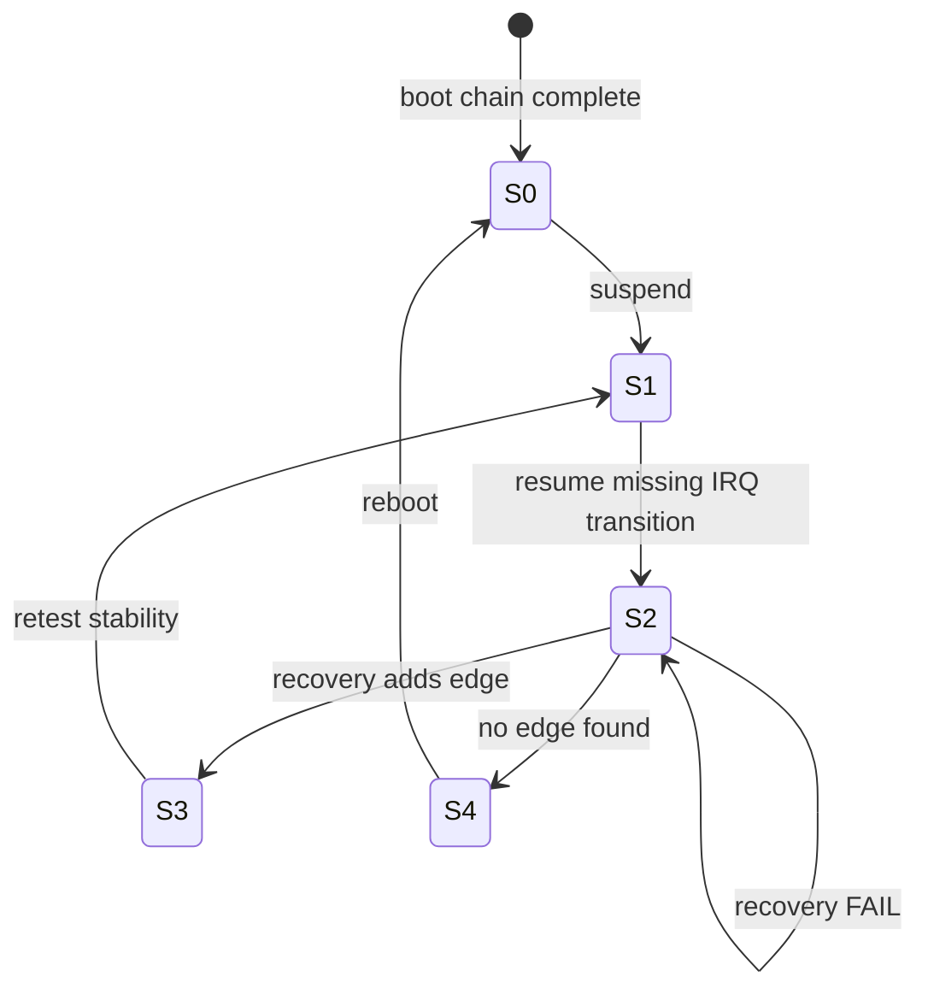

# State transitions — what edge is missing?

English (canonical). Resolution does **not** run "experiments." It discovers **missing transitions** between broken and healthy states.

**Question:** Not *"does R04 PASS?"* but *"what transition between S2 and S3 is missing from system resume?"*

---

## Macro states

| State | Meaning |
|-------|---------|
| **S0** | Audio functional |
| **S1** | Suspended |
| **S2** | Post-resume broken (timeout, no PCM) |
| **S3** | Recovered without reboot |
| **S4** | Only reboot helps |

Research closed **S1 → S2** (system resume breaks). Resolution maps **S2 → S3** edges.

**S2 oracle (v2.1):** `-110 ∧ handler_since_pm=0 ∧ STAT1=0x4` — see [WITNESS-QUALITY.md](WITNESS-QUALITY.md). Recovery runs only when witness **VALID**.

---

## Boot chain (always reaches S0)

```text
Boot
  │
  ▼
ACP initialized          (PCI probe, MMIO, clocks)
  │
  ▼
IRQ registered           (devm_request_threaded_irq)
  │
  ▼
Manager running          (probe, reset, D0)
  │
  ▼
STAT1 → PCI INTx         (handler fires)
  │
  ▼
Codec enumerated         (RT721 ATTACHED)
  │
  ▼
Audio works              (S0)
```

---

## System resume chain (lands in S2)

```text
Resume
  │
  ▼
ACP initialized          (acp_hw_resume, ret=0)     ✓ same witness
  │
  ▼
Manager running          (manager_reset, D0)        ✓ same witness
  │
  ▼
STAT1 interrupt pending  (STAT&0x4 @ ~50 ms)        ✓ FACT
  │
  ▼
(no PCI interrupt)       (handler_since_pm=0)       ✗ MISSING TRANSITION
  │
  ▼
Timeout                  (RT721 -110)               → S2
```

**Missing transition (post-E04):** Not manager probe — enumeration works. Missing edge is **below ATTACHED → audio usable**. See [RECOVERY-DOMAINS.md](RECOVERY-DOMAINS.md).

---

## Post-E04: manager domain closed

```text
manager reprobe
      │
      ▼
RT721 ATTACHED ──► enumeration OK
      │
      └──► audio usable  ✗ (missing edge)
```

---

## Recovery adds transitions from S2

Each recovery action tries to **insert** a missing edge:

```text
S2 (timeout)
  │
  ├── R09 runtime PM cycle ──────────► S3 ?  (system PM ≠ runtime PM)
  │
  ├── R07 PCI unbind+bind ───────────► S3 ?  (probe OK, pm_resume not)
  │
  ├── R04 reprobe manager ───────────► S3 ?  (manager probe OK, resume not)
  │
  ├── R01 restart PipeWire ──────────► S2    (expected: no kernel change)
  │
  └── R08 PCI remove+rescan ─────────► S3 ?  (re-enumeration level)
```

Record **which transition** each action adds — not only PASS/FAIL.

---

## Transition table (fill from runs)

| Recovery | Adds transition | Result | Missing transition implied |
|------------|-------------------|--------|----------------------------|
| R09 | runtime_suspend → runtime_resume on ACP PCI | `?` | **retest** — RUN-02 never suspended |
| R07 | PCI driver teardown → full probe | `?` | retest with VALID S2 |
| R08 | PCI remove → rescan → re-probe | `?` | explored (ambiguous) |
| R04 | manager unbind → bind (probe path) | **FAIL** | probe → RT721 ATTACHED; ALSA still broken — **L2 closed** |
| R01 | userspace daemon restart | `?` | none expected (low knowledge) |

---

## R09 special case

### If R09 → S3

Not merely "runtime PM works." You prove:

> **Hardware can return to a correct state. Only the system suspend/resume sequence is wrong.**

Research re-opens with a **narrow** question:

> What does runtime PM do that system PM does not?

See [UPSTREAM-VALUE.md](UPSTREAM-VALUE.md) · [research loop](#research-reactivation)

### If R09 → S2 (FAIL)

Also valuable:

> `runtime_resume` hits the **same** broken path — look deeper (PCI bridge, ACPI, firmware).

Forces **firmware/** branch or ACPI — not more system-PM tweaks.

---

## Boot vs resume as transition diff

| Transition | Boot | Resume |
|------------|------|--------|
| ACP MMIO init | probe path | `acp_hw_resume` |
| `request_irq` | fresh | same descriptor |
| Manager init | probe + reset | pm_resume + reset |
| STAT1 → handler | ✓ | ✗ |
| Enumeration | ✓ | ✗ (no worker) |

Recovery that works tells you **which row** resume fails to replay.

---

## Metrics (prioritize together)

| Metric | Meaning |
|--------|---------|
| **Recovery Cost** | Practical price (1–8, lower better) |
| **Knowledge Gain** | How much the edge narrows search (1–5, higher better) |
| **Priority score** | Knowledge ÷ Cost — run high scores first when exploring |

See [DEPTH-MATRIX.md](DEPTH-MATRIX.md) · [TRACKER.md](TRACKER.md)

---

## Research reactivation

`resolution/` is a **high-quality hypothesis generator** for `research/`.

```text
resolution: stable S2 → S3 edge discovered
        ↓
research: ONE comparison — "what does X do that system PM doesn't?"
        ↓
upstream: clean patch
```

Do **not** re-open broad investigation. One causal difference only.

| If edge is… | Research question |
|-------------|-------------------|
| R09 PASS | system PM vs runtime PM callback diff |
| R07 PASS | `probe()` vs `pm_resume()` call graph |
| R04 PASS | manager `probe()` vs `pm_resume()` |
| All FAIL → firmware/ | Windows handoff sequence |

---

## Graph


